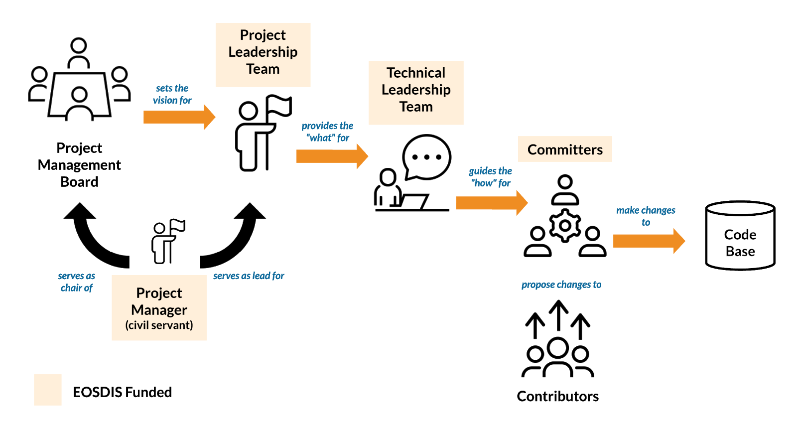
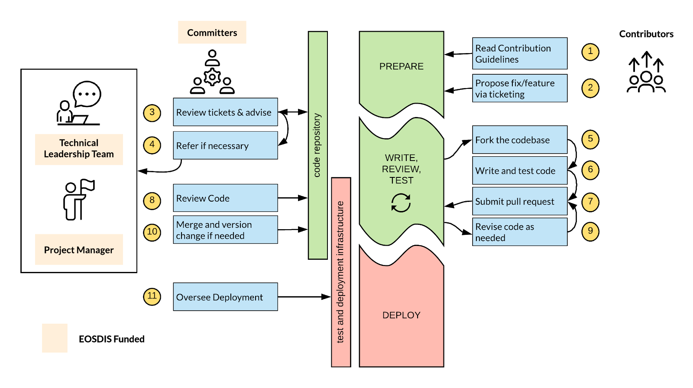

<!-----
NEW: Check the "Suppress top comment" option to remove this info from the output.

Conversion time: 3.878 seconds.

Using this Markdown file:

1. Paste this output into your source file.
2. See the notes and action items below regarding this conversion run.
3. Check the rendered output (headings, lists, code blocks, tables) for proper
   formatting and use a linkchecker before you publish this page.

Conversion notes:

* Docs to Markdown version 1.0β29
* Thu Feb 25 2021 22:43:48 GMT-0800 (PST)
* Source doc: Copy of EOSDIS General Open Source Software Collaboration and Contribution Process
* Tables are currently converted to HTML tables.

----->

**NASA ESDIS**

## EOSDIS General Open Source Software Collaboration and Contribution Process

### **WORKING DRAFT: October 2020**

## Overview

This document is intended to serve as guidance for parties interested in collaborating and contributing code,
documentation, and examples to the EOSDIS software projects. It is expected that this document serves as a blueprint for
existing forthcoming open source software development efforts undertaken by the EOSDIS community.

This process is inspired and influenced by “the Apache Way” practiced by
the [Apache Software Foundation](https://www.apache.org/)  but is tailored to EOSDIS specific needs and communication
patterns.

## Goals of this Document

1. Establish criteria for projects to be considered for this process
2. Establish roles and responsibilities for contributions to NASA EOSDIS software
3. Identify key communication flows, as well as information on documentation, testing and deployment paradigms
4. Outline high-level process expectations for contributions and provide example process flows for these contributions

## What Projects are Appropriate for this Process?

A _project_ in this context represents a system of software elements that are being developed to fulfill a system need
for EOSDIS (e.g. the Common Metadata Repository, Cumulus, GIBS). The word _system_ may be used throughout this document
interchangeably with the word _project_.

### Assumptions

It is assumed that each project guided by this document has already established best practices based
on [NASA Procedural Requirements (NPR) 7150.2B](https://nodis3.gsfc.nasa.gov/displayDir.cfm?t=NPR&c=7150&s=2B)

In addition, there are several additional elements that should be in place before establishing the roles and processes
described below:

* Code is already open source approved and publicly available[^1]

* Development is being conducted in publicly available software repositories (e.g. gitlab, github)
* Process is in place to allow for [continuous integration](https://en.wikipedia.org/wiki/Continuous_integration ).
* A suite of regression tests is available and can be run by external contributors
* The project has an existing documented policy/process for setting vision and roadmaps, tracking releases, and
  deployments.
* Deployment instructions for the software is well documented to facilitate collaboration and reproducible
  installations.

## Code Contribution: Roles and Responsibilities

**_Project Structure: This diagram lays out the relationships between the various roles in the team, showing how each
role interacts as a high level_**

### Users

Users are any end-users, operators, or monitors of the software system.

##### Responsibilities

* Using the software
* Providing bug reports and new feature requests via appropriate processes as documented by Technical Leadership Team
* Providing feedback to Project Leadership Team on proposed new features and testing fixes

### Project Management Board (PMB)

The project management board is a group of 3-7 individuals representing various stakeholders of the software system at
various levels including DAAC and ESDIS members. A member of the Project Leadership Team (PLT) serves as the chair of
this board and is in charge of populating the board.

##### Responsibilities

* Setting overall project direction and policy for the project
* Designating specific components of the system for inclusion in the centralized governance policy (laid out by this
  document)
* Conducting monthly reviews of the project processes and status.
* Conducting less-frequent, periodic, and holistic system reviews, including soliciting third party reviews of the
  system for usability, affordability, and security as needed
* Conducting periodic surveys of users to increase effectiveness of the system
* Continually monitoring and reporting on the vitality of the project via metrics such as:
    * Number of code contributions from DAACs, ESDIS, external sources
    * Number of community members and their related affiliation and role
* Interacting with Project Leadership Team (PLT) to discuss issues of importance
* Approving Technical Leadership Team members
* Approving promotion of project contributors to committers under advisement from PLT and TLT

### Project Manager (PM)

The project shall have a NASA Civil Servant designated as the overall project manager. The PM will be the overall
decision maker for the project. This role ensures no conflicts of interest with existing contracts or other external
entities seeking to influence system functionality. Specifically this PM will deal with decisions related to significant
contributions from external contributors. (See the specific section of this document related to External Contributions
for more details) The PM will serve as the chair of the PMB and will be part of the Project Leadership Team (PLT) and
fulfill responsibilities outlined for that role.

### Project Leadership Team (PLT)

The project leadership team (PLT) consists of 1-2 overall system leads (one of whom is the Project Manager) who work
closely with the PMB and Technical Leadership Team (TLT) to oversee system development and deployment.

##### Responsibilities

* Interacting closely with the PMB advising on system direction, as well as shifts in technical team membership and
  processes
* Working on sprint planning and reviews with committers, ensuring all work aligns with system direction
* Working with the TLT to determine release cycle and versioning updates
* Keeping project schedule updated and reporting status to PMB as requested
* Maintaining project requirements baselines as needed
* Communicating status to EOSDIS, ESDIS leadership and HQ as requested
* Recommending technical leadership team members to the PMB
* Recommending contributors/developers promotion to committers/reviewers to the PMB
* Inviting and appointing members of the PMB.
* Maintaining contribution guidelines (this document)
* Fulfilling the "Product Owner" role of a scrum.
* Act as point of contact for ESDIS-funded DAACs who request new features or introduce high-priority issues/bugs

### Technical Leadership Team (TLT)

The TLT consists of 1-2 technical leads who work closely with the project leadership team and committers/reviewers to
maintain the technical integrity, quality, stability, and direction of the system. The TLT may or may not also be a
member of the PLT or PMB and may or may not be a committer/reviewer on the system.

##### Responsibilities

* Interacting closely with the PLT, advising on technical direction, as well as shifts in technical team membership and
  processes
* Conducting periodic technical reviews of the system and process
* Ensuring code quality, technical integrity, system stability, development progress, and smooth deployment into target
  environment
* Developing and maintaining documentation of style guides, best practices, and code quality expectations to be utilized
  by Committers and Contributors.
* Working with the PLT to determine release cycle and versioning updates
* Documenting release cycle and versioning updates
* Working with the PLT in specifying, documenting, and maintaining tools to be used for code development, system
  documentation, issue tracking, testing, continuous integration, automation activities and deployment (e.g.
  JIRA/Github/Circle CI/Bamboo/Wiki)
* Recommending contributors/developers promotion to committers/reviewers to the PLT
* Fulfilling the "System Architect" (and Scrum Master) role(s) of an agile organization.

### Committers

These members of the team do all code merges into the main project repositories. All merged code must have undergone
review by at least one other committer. All committers to the project codebases must be directly NASA-funded.

##### Responsibilities

* Working with TLT to develop and execute **sprint** plans based on TLT direction
* Fixing and testing bugs
* Participating in daily/weekly scrum meetings to discuss development progress and issues.
* Reviewing code/documentation contributions from other committers and contributors, ensuring compliance with style
  guides, technical roadmap and code quality expectations
* Maintaining documentation of code processes and API changes
* Working with deployment team to ensure smooth testing delivery of releases
* Integrating contributions from contributors into baseline
* Contributing code/tests/documentation in accordance with style guides, technical roadmap and code quality expectations
  outlined by the TLT

### Contributors

These members of the team may contribute code, documentation, containerized libraries, and examples to the system but
may not merge any changes to the repository baselines. Contributors are not expected to execute on sprint plans,
participate in scrums, or contribute critical functionality to the system. Contributors are not necessarily NASA-funded.
NASA-funded contributors may be promoted to committers via the PMB if it makes sense to do so and they are recommended
by both the TLT and PLT.

##### Responsibilities

* Contributing and justifying code/tests/documentation in accordance with style guides, technical roadmap and code
  quality expectations outlined by the TLT
* Identifying, troubleshooting, fixing test failures and submitting bug fixes.

## External Contributions, Community Engagement and Outreach

It is the responsibility of the Project Manager to act as the primary point of contact for external contributors seeking
to contribute to or modify the system in a significant way[^2].

Furthermore, the PM will work with the PMB and the PLT to develop strategies for community engagement and outreach for
the project.

## Communication

All meeting minutes, actions, and notes should be kept in the [Earthdata wiki](https://wiki.earthdata.nasa.gov) under
the specific project space.

From time to time, mail may be used for ongoing community discussions, system-wide announcements, release tracking,
feedback solicitation, etc. The project should maintain a mailing list (
e.g. [cumulus-all@lists.nasa.gov](mailto:cumulus-all@lists.nasa.gov)) to facilitate broad communication within the
community. All stakeholders should be subscribed to the _project’s_ mailing list.

EOSDIS project users, contributors, committers, and members of the TLT, PLT, and PMB are all encouraged to utilize Slack
for day-to-day discussion and non-sensitive interactions. However, Slack **SHALL NOT** be used for documenting decision
making. Slack is not an official NASA, or ESDIS-approved, endorsed tool. Only Public Access and Administrative
Information is allowed in Slack, neither ITAR nor SBU information is appropriate for this service.

Decisions on project direction, meeting notes from team meetings or PMB communications should be published as soon as
feasible to a public facing site, such as the wiki.

Communication for the PMB, PLT, and TLT should be free-flowing and ad-hoc via all channels mentioned above and should
include more formal, monthly meetings of the full group.

## Documentation

Code quality, coding standards, test coverage, continuous integration processes, API documentation are all the purview
of the PLT and TLT and shall be documented in the project wiki, or via README files within the repository.

## Testing

While it is expected that the projects utilizing this process will leverage automated test technologies and continuous
integration techniques, specific testing policies and practices are determined and documented by the Technical
Leadership Team (TLT). Testing policy should be enforced by committers and the TLT via code review and approvals. This
policy will be available in the project wiki, or via README files within the repository.

## Deployment Environments and Releases

The Technical Leadership Team will work with the Project Leadership Team to determine the best timelines for new
releases of the system. System releases should allow enough time for extensive testing and will maintain backwards
compatibility with existing configured products.

Each system release for ESDIS production usage should progress through a Systems Integration Test (SIT) environment, and
a User Acceptance Test (UAT) environment prior to general release to public facing production environments. If deemed
necessary by the TLT/PLT team, release will also undergo load/performance testing.

As mentioned in the Assumptions subsection of this document, each project adhering to this process should have a
well-documented and maintained release, test, and deployment process.

## Code of Conduct

Software system development is a highly collaborative endeavor and open source projects even more so. “A code of conduct
is necessary so members of an organization or group understand the standards they will be expected to uphold when
interacting with each other and others outside the organization.” [^3]

Team members agree to abide by the Contributor Covenant as outlined
here: [https://www.contributor-covenant.org/version/1/4/code-of-conduct.html](https://www.contributor-covenant.org/version/1/4/code-of-conduct.html)

## Security

All public facing EOSDIS projects covered by this document should follow a unified security policy. This security policy
is meant to cover a wide-variety of topics including, but not limited to:

* Automated Tooling
* Developer Best Practices
* Process documentation
* Communication Patterns
* Risk Tolerance

This security policy document will be covered by EOSDIS configuration management and will maintain an active copy in the
Earthdata wiki.

## Project Closeout

Eventually, all projects tend to be retired and replaced by new initiatives and technologies. Software is especially
prone to obsolescence and therefore special attention should be paid to the proper retirement process.

Each project should develop a close-out plan focused on retiring production usage of the project within EOSDIS and
notification of external stakeholders of the close-out. This plan should include elements such as:

* Code base retirement and decommissioning
* Stakeholder communication
* Smooth transition to new technology as needed

The following is a helpful resource when considering shuttering a
project: [https://github.com/todogroup/guides/blob/master/shutting-down-an-open-source-project.md](https://github.com/todogroup/guides/blob/master/shutting-down-an-open-source-project.md)

##  

## Example Scenarios and FAQ

#### Contribution and promotion of code/documentation to repository

**_Example Workflow: Codebase Changes from both internal and external contributors._**

#### How can I become a committer? (Meritocracy)

While this project’s vision is set by the PMB and executed by the PLT and TLT, individual contributors (who are funded
by NASA) may be promoted to committers assuming they have garnered the respect within the project through their
contributions and are willing to step into that role. As in the Apache Software Foundation, newcomers and contributors
are seen as volunteers that want to help and are devoted to seeing the project realize its vision.

#### Does this project follow Agile processes for development?

Probably. Generally EOSDIS employs agile processes. While Users and Contributors are not expected to participate in
scrum and sprint planning activities, it is assumed that they will be aware of such processes in use by committers and
other project leadership roles

#### Who manages/controls determining what changes will be applied to the project’s codebases?

The Project Manager will review and ultimately act as decision maker on large functionality changes and re-architecting
of the system. This will be done with advisement of the PMB, TLT and other EOSDIS leadership.

#### Can we contribute code written by others to this repository? Or can we merge third party open source software into the codebase?

This is dependent on the license used by the specific project. If the project is released with
the [Apache 2.0 license](https://www.apache.org/licenses/LICENSE-2.0), it allows contributions from third party open
source software assuming they are utilizing proper licensing and is approved by the TLT and PLT. Please refer to the
specific license for more information.

#### Can I fork this repository and make my own project?

Yes. We encourage forking as a model for contributing to the code base.

However, when approaching the idea of creating a permanent fork of the repository maintained by a separate organization
and group to add new functionality or change architecture, we strongly urge you to work with the Project Management
Board and the Technical Lead to find a way to merge your changes/additions back into the main repository.

#### Is there a coding style guide available?

Yes. Coding style guide is specified and maintained by the TLT and outside the scope of this document.

#### If I want to contribute, do I need to enter into an [CCLA/ICLA](https://en.wikipedia.org/wiki/Contributor_License_Agreement)?

The short answer is: maybe. NASA’s Patent Counsel can provide guidance for specific scenarios. If you are contributing
code on your personal time, whether a government employee, contractor, or funded collaborator, please contact the
project management board to discuss.

#### Can we create add-on modules to the project codebase?

Yes. Contact the PM and PLT for information and guidance.

#### Will DAACs have to control/manage changes to their added project modules?

Yes, DAACs will have a contact to control the changes to the codebase for the modules they are responsible for and will
follow the same process outlined for core project code changes.

#### If your proposed module is rejected what are your options?

If a module is ultimately rejected from being included in the project or as an add-on module, that only means that the
PM/PLT does not think it’s applicable to the project codebase, it can be built/deployed/contributed to as an independent
project/module in the ECC or via other source code repositories

#### Do developers need to provide good, concise, complete descriptions of the capabilities of their developed modules?

YES. Documentation is vital and should be maintained within the project’s wiki space.

##  

## Acronyms/Glossary

<table>
  <tr>
   <td>API
   </td>
   <td>Application Programming Interface
   </td>
  </tr>
  <tr>
   <td>CI
   </td>
   <td>Continuous Integration
   </td>
  </tr>
  <tr>
   <td>CLA  \
(ICLA, CCLA)
   </td>
   <td>Contributor License Agreement, often individual  (ICLA) or commercial (CCLA)

<a href="https://www.clahub.com/pages/why_cla">https://www.clahub.com/pages/why_cla</a>
   </td>
  </tr>
  <tr>
   <td>DAAC
   </td>
   <td>Distributed Active Archive Center
   </td>
  </tr>
  <tr>
   <td>EC2
   </td>
   <td>Elastic Compute Cluster
   </td>
  </tr>
  <tr>
   <td>EOSDIS
   </td>
   <td>Earth Observing System Data and Information System
   </td>
  </tr>
  <tr>
   <td>ESDIS
   </td>
   <td>Earth Science Data and Information Systems
   </td>
  </tr>
  <tr>
   <td>NGAP
   </td>
   <td>NASA Compliant General Application Platform
   </td>
  </tr>
  <tr>
   <td>PM
   </td>
   <td>Project Manager (a NASA civil servant)
   </td>
  </tr>
  <tr>
   <td>PMB
   </td>
   <td>Project Management Board
   </td>
  </tr>
  <tr>
   <td>PLT
   </td>
   <td>Project Leadership Team
   </td>
  </tr>
  <tr>
   <td>TLT
   </td>
   <td>Technical Leadership Team
   </td>
  </tr>
  <tr>
   <td>SAFe®
   </td>
   <td>Scaled Agile Framework® <a href="https://www.scaledagileframework.com/">https://www.scaledagileframework.com/</a> \
(SAFe and Scaled Agile Framework are registered trademarks of Scaled Agile, Inc.)
   </td>
  </tr>
  <tr>
   <td>Scrum
   </td>
   <td>
   </td>
  </tr>
  <tr>
   <td>Sprint
   </td>
   <td>
   </td>
  </tr>
</table>

## Additional Resources

* Github Guidelines for
  Contributions [https://help.github.com/articles/setting-guidelines-for-repository-contributors/](https://help.github.com/articles/setting-guidelines-for-repository-contributors/)
* Government Open Source Program
  Guidelines  [http://18f.github.io/open-source-program/](http://18f.github.io/open-source-program/)
* Security process for Open Source
  Projects [https://alexgaynor.net/2013/oct/19/security-process-open-source-projects/](https://alexgaynor.net/2013/oct/19/security-process-open-source-projects/)
* Apache Software Foundation “How it
  works” [http://apache.org/foundation/how-it-works.html](http://apache.org/foundation/how-it-works.html)
* How Esri is doing it: [https://github.com/esri/contributing](https://github.com/esri/contributing)
* How to write the perfect pull
  request: [https://github.com/blog/1943-how-to-write-the-perfect-pull-request](https://github.com/blog/1943-how-to-write-the-perfect-pull-request)
* Open Sourcing for Government
  Attorneys [http://ben.balter.com/2014/10/08/open-source-licensing-for-government-attorneys/](http://ben.balter.com/2014/10/08/open-source-licensing-for-government-attorneys/)
    * _“The work of contributors does not trigger gift authority or Anti-Deficiency Act obligations, unless the work is
      performed specifically for the agency.”_
* NASA Earth Science Data Systems Open Source Working Group Recommendations (Draft Google Doc) (December
  2015) [https://docs.google.com/document/d/113zMYrNV0WccJkKSPq6m-RtBbvy2P0Ei7s3kM-Ts99I/edit?usp=sharing](https://docs.google.com/document/d/113zMYrNV0WccJkKSPq6m-RtBbvy2P0Ei7s3kM-Ts99I/edit?usp=sharing)
* Reuse Readiness Levels (RRLs) NASA Earth Science Data Systems Software Reuse Working Group (April
  2010) [https://cdn.earthdata.nasa.gov/conduit/upload/2004/RRLs_v1.0.pdf](https://cdn.earthdata.nasa.gov/conduit/upload/2004/RRLs_v1.0.pdf)
* Shutting down an open source
  project: [https://github.com/todogroup/guides/blob/master/shutting-down-an-open-source-project.md](https://github.com/todogroup/guides/blob/master/shutting-down-an-open-source-project.md)

## Relationship Project Roles and SAFe roles

Many projects governed by this document are also being developed using the Scaled Agile Framework® or SAFe® practices.
The table below is intended to describe the project roles described in this document and how they relate to various
roles with SAFe

<table>
  <tr>
   <td>
    Scrum or SAFe Role →

Project Role ↓
   </td>
   <td>Customer
   </td>
   <td>Product Owner
   </td>
   <td>Scrum Master
   </td>
   <td>Scrum Team
   </td>
  </tr>
  <tr>
   <td>Users
   </td>
   <td>
   </td>
   <td>
   </td>
   <td>
   </td>
   <td>
   </td>
  </tr>
  <tr>
   <td>Project Management Board
   </td>
   <td>X
   </td>
   <td>X
   </td>
   <td>
   </td>
   <td>
   </td>
  </tr>
  <tr>
   <td>Project Manager
   </td>
   <td>X
   </td>
   <td>
   </td>
   <td>
   </td>
   <td>
   </td>
  </tr>
  <tr>
   <td>Project Leadership Team
   </td>
   <td>X
   </td>
   <td>X
   </td>
   <td>
   </td>
   <td>
   </td>
  </tr>
  <tr>
   <td>Technical Leadership Team
   </td>
   <td>
   </td>
   <td>
   </td>
   <td>X*
   </td>
   <td>
   </td>
  </tr>
  <tr>
   <td>Committers
   </td>
   <td>
   </td>
   <td>
   </td>
   <td>X*
   </td>
   <td>X**
   </td>
  </tr>
  <tr>
   <td>Contributors
   </td>
   <td>
   </td>
   <td>
   </td>
   <td>
   </td>
   <td>
   </td>
  </tr>
</table>

* The Scrum Master role may be filled by either a member of the TLT or the Committers. \
  ** Only NASA-funded members of the Scrum Team nominated by the TLT are Committers.

## Responsible Team

The following people provided significant contributions or inspiration for this document. \

<table>
  <tr>
   <td>
<ul>

<li>Katie Baynes
</li>
</ul>
   </td>
   <td>
<ul>

<li>Patrick Quinn
</li>
</ul>
   </td>
  </tr>
  <tr>
   <td>
<ul>

<li>Taylor Wright
</li>
</ul>
   </td>
   <td>
<ul>

<li>Christopher Torbert
</li>
</ul>
   </td>
  </tr>
  <tr>
   <td>
<ul>

<li>Christine Smit
</li>
</ul>
   </td>
   <td>
<ul>

<li>Jason Werpy
</li>
</ul>
   </td>
  </tr>
  <tr>
   <td>
<ul>

<li>Ian Schuler
</li>
</ul>
   </td>
   <td>
<ul>

<li>Manil Maskey
</li>
</ul>
   </td>
  </tr>
  <tr>
   <td>
<ul>

<li>Christopher Lynnes
</li>
</ul>
   </td>
   <td>
<ul>

<li>Lewis McGibbney
</li>
</ul>
   </td>
  </tr>
  <tr>
   <td>
<ul>

<li>Mark McInerney
</li>
</ul>
   </td>
   <td>
<ul>

<li>Michael Gangl
</li>
</ul>
   </td>
  </tr>
  <tr>
   <td>
<ul>

<li>Chris Stoner
</li>
</ul>
   </td>
   <td>
<ul>

<li>Heather Goo
</li>
</ul>
   </td>
  </tr>
  <tr>
   <td>
<ul>

<li>Darla Werner
</li>
</ul>
   </td>
   <td>
<ul>

<li>Peter Plofchan
</li>
</ul>
   </td>
  </tr>
  <tr>
   <td>
<ul>

<li>Paul Ramirez
</li>
</ul>
   </td>
   <td>
<ul>

<li>Ajinkya Kulkarni
</li>
</ul>
   </td>
  </tr>
  <tr>
   <td>
<ul>

<li>Dana Shum
</li>
</ul>
   </td>
   <td>
<ul>

<li>Nathan Clark
</li>
</ul>
   </td>
  </tr>
</table>

<!-- Footnotes themselves at the bottom. -->

## Notes

[^1]:

     Generally, NASA licenses software under either the [Apache 2.0](https://opensource.org/licenses/Apache-2.0) or NASA Open Source Agreement ([NOSA](https://opensource.org/licenses/NASA-1.3)) licenses. This document assumes a “nonreciprocal” licenses ([https://opensource.org/node/875](https://opensource.org/node/875)) and not “reciprocal” licenses such as GPL

[^2]:
A “significant way” in this context means addition of features and functionality and does not refer to bug fixes for
existing functionality nor to minor edits in text or code. For some changes, the project leadership team

[^3]:
[https://www.reference.com/world-view/important-code-conduct-eb44a47162843d27](https://www.reference.com/world-view/important-code-conduct-eb44a47162843d27)
